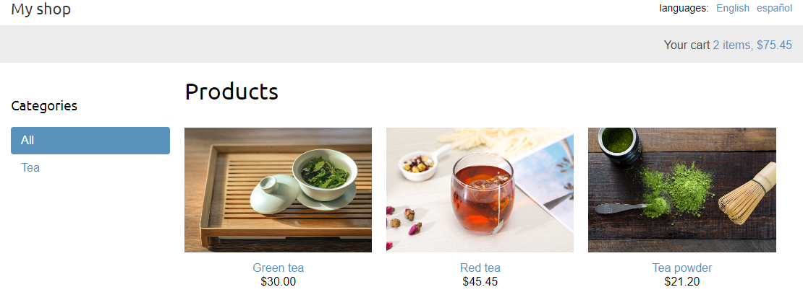
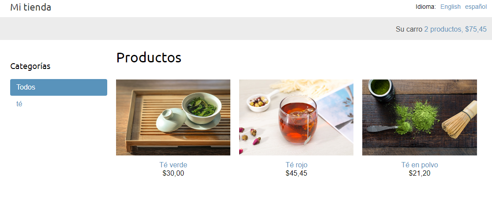

## This is a fully-featured on-line shop made in Django

The features of this application are:

- Implements shopping cart using Django sessions.
- Uses custom context processors to make the cart available
  to all templates.
- Manages customer orders.
- Sends asynchronous notifications using [Celery](https://docs.celeryq.dev/) and [RabbitMQ](https://www.rabbitmq.com/).
- Monitors Celery using [Flower](https://github.com/mher/flower.)
- Integrates [Stripe](https://stripe.com/) to process payments.
- Implements a webhook to receive payment notifications from Stripe.
- Uses a customized view in the Django administration site.
- Creates admin actions and enables generation of CSV files.
- Generates PDF invoices dynamically using [Weasyprint](https://weasyprint.org/).
- Uses a coupon system to apply discounts to orders which integrates with Stripe payments.
- Implements a product recommendation engine using Redis.
- Adds internationalization to the shop.
- Uses [Rosetta](https://github.com/mbi/django-rosetta) to manage translations.
- Translates URL patterns and allows for a language selection by the user.
- Translates models using [django-parler](https://github.com/django-parler/django-parler).
- Localizes forms using [django-localflavor](https://github.com/django/django-localflavor).
